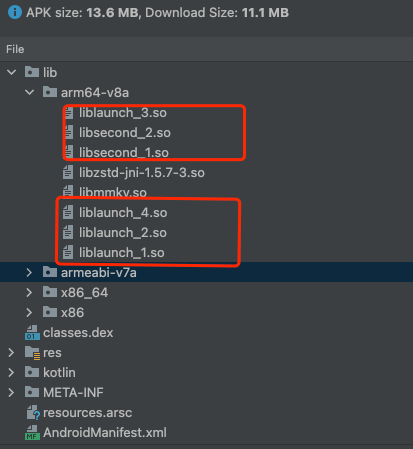

# Nano
[](https://www.apache.org/licenses/LICENSE-2.0) [](https://github.com/yourusername/yourrepo/pulls) [](https://jitpack.io/#threeloe/nano)
    
[README 中文版](./README.zh-CN.md)

# Nano
Nano is an Android SO file compression framework designed to reduce the size of shared object (SO) files within APK or AAB files while supporting runtime dynamic loading. Common use cases include:
* **Pre-installed apps** - Device manufacturers often require SO files to be stored in non-compressed form within the APK, significantly increasing package size while imposing strict size limitations.
* **Lite versions** - Applications with extremely stringent package size requirements.

## Demo Screenshot


## Quick Start
### Plugin Integration
Declare plugin dependencies and repositories in your root `build.gradle`:
```groovy
buildscript {
    repositories {
        maven { url "https://jitpack.io" }
    }

    allprojects {
        repositories {
            maven { url "https://jitpack.io" }
        }
    }

    dependencies {
        classpath "com.github.threeloe.nano:plugin:1.0.0"
    }
}
```
Apply the Nano plugin in your app's build.gradle:
```groovy
apply plugin: "com.threeloe.nano"
nano {
    enable = true
    compressMethod = "zstd" // Compression method, supports zstd and xz
    groups {  // Group configuration, each group can be compressed into multiple file blocks
        launch {
            blockNum 4  
            include "libijkffmpeg.so"
            include "libijkplayer.so"
            include "libijksdl.so"
            include "libshadowhook.so"
        }
        second {
            blockNum 2
            include "libtensorflowlite_jni.so"
            include "libtensorflowlite_gpu_jni.so"
        }
    }
}
```
### SDK Integration
Add the sdk dependency:
```groovy
dependencies {
   implementation "com.github.threeloe.nano:nano:1.0.0"
}
```
#### For Android 9+ Only (e.g., pre-installed apps)
If you only want to support Android 9 and above, such as in pre-installed package , you can simply register the AppComponentFactory:
```kotlin
@RequiresApi(Build.VERSION_CODES.P)
class DemoAppComponentFactory : AppComponentFactory(){
    override fun instantiateClassLoader(cl: ClassLoader, aInfo: ApplicationInfo): ClassLoader {
        // Replace with the new ClassLoader
        return Nano.install(cl, aInfo)
    }
}
```
And initialize code in the Application:
``` kotlin
class DemoApplication :Application() {

    override fun attachBaseContext(base: Context?) {
        super.attachBaseContext(base)
        Nano.init(this, null)
        Nano.decompress("launch")

        //Business logic starts here
    }

    override fun onCreate() {
        super.onCreate()
        MMKV.initialize(
            this
        )
        //Business logic
    }
}
```
#### For Full Android Compatibility (5.0+)
If you want to support all Android versions, you need to modify the application's Application to inherit from NanoApplication and migrate the original business initialization logic to a NanoApplicationLike implementation class, as shown below: 
``` kotlin
class DemoApplication : NanoApplication() {

    override fun getApplicationLikeClassName(): String {
        return "com.threeloe.nano.demo.app.DemoApplicationLike"
    } 
}

class DemoApplicationLike(app: Application) : NanoApplicationLike(app) {

    override fun attachBaseContext(base: Context?) {
        super.attachBaseContext(base)
        Nano.init(application, null)
        Nano.decompress("launch")
        //Business logic starts here
    }

    override fun onCreate() {
        super.onCreate()
        //Business logic 
        MMKV.initialize(
            application
        )
    }
}
```
## Features
* **Group Compression** - Support SO file grouping, each group can be split into multiple blocks for concurrent decompression.
* **Decompression Modes** - Supports synchronous/asynchronous decompression.
* **Compression Algorithms** - [zstd](https://github.com/facebook/zstd) (faster decompression) or [xz](https://github.com/tukaani-project/xz) (higher compression ratio).

## Compatibility
* **Gradle Plugin**: Compatible with Android Gradle Plugin 7.0+
* **Android Versions**: Supports Android 5.0 (API 21) and higher

## License
[Apache License](./LICENSE)