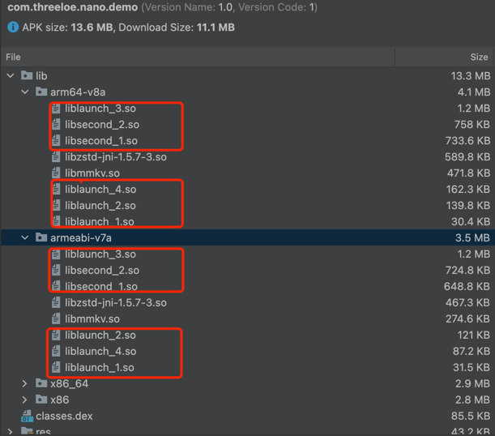

# Nano
[](https://www.apache.org/licenses/LICENSE-2.0) [](https://github.com/threeloe/nano/pulls) [](https://jitpack.io/#threeloe/nano)

Nano是一个Android SO文件压缩框架，用于将APK/AAB文件中的SO文件压缩为更小体积，并支持运行时动态加载。常见应用场景：
* **预装包场景**：厂商要求SO文件必须以store（非压缩）形式存在，导致包体积显著增大，同时厂商对包体大小有严格限制
* **极速版应用**：对包体积要求极高的应用场景

## 效果图


## 快速上手
### 插件接入
在项目根目录的`build.gradle`声明插件依赖和仓库：
```groovy
buildscript {
    repositories {
        maven { url "https://jitpack.io" }
    }
    
    allprojects {
        repositories {
            maven { url "https://jitpack.io" }
        }
    }
    
    dependencies {
        classpath "com.github.threeloe.nano:plugin:1.0.0"
    }
}
```
在app模块的build.gradle中apply nano 插件：
```groovy
apply plugin: "com.threeloe.nano"
nano {
    enable = true
    compressMethod = "zstd" // 压缩算法，支持zstd（解压快）或xz（压缩率高）
    groups {  // SO文件分组配置，每组可压缩为多个文件块
        launch {
            blockNum 4  
            include "libijkffmpeg.so"
            include "libijkplayer.so"
            include "libijksdl.so"
            include "libshadowhook.so"
        }
        second {
            blockNum 2
            include "libtensorflowlite_jni.so"
            include "libtensorflowlite_gpu_jni.so"
        }
    }
}
```
### SDK接入
添加依赖：
```groovy
dependencies {
    implementation "com.github.threeloe.nano:nano:1.0.0"
    //zstd decompression method for Android
    implementation "com.github.luben:zstd-jni:1.5.7-3@aar"
}
```
#### 仅支持Android 9+（如预装包）
如果你只是想支持高版本系统，比如想预装包这样的场景，可以只注册AppComponentFactory：
```kotlin
@RequiresApi(Build.VERSION_CODES.P)
class DemoAppComponentFactory : AppComponentFactory(){
    override fun instantiateClassLoader(cl: ClassLoader, aInfo: ApplicationInfo): ClassLoader {
        return Nano.install(cl, aInfo) // 替换ClassLoader
    }
}
```
然后Application中初始化：
```kotlin
class DemoApplication :Application() {

    override fun attachBaseContext(base: Context?) {
        super.attachBaseContext(base)
        val nanoConfig = NanoConfig()
        // configure the decompression method implementation
        nanoConfig.zstdCompressMethod(object : IDecompressMethod {
            override fun getDecompressedStream(input: InputStream): InputStream {
                return ZstdInputStream(input)
            }
        })
        Nano.init(application, nanoConfig)

        //Business logic starts here
    }

    override fun onCreate() {
        super.onCreate()
        MMKV.initialize(
            this
        )
        //Business logic
    }
}
```
#### 全Android版本兼容（5.0+）
如果你想支持所有的Android版本呢，你需要改造Application类继承`NanoApplication`，并实现`getApplicationLikeClassName()`方法返回你的`NanoApplicationLike`类名，
把原有Application中的业务逻辑放到`NanoApplicationLike`中：
```kotlin
class DemoApplication : NanoApplication() {
    override fun getApplicationLikeClassName(): String {
        return "com.threeloe.nano.demo.app.DemoApplicationLike"
    } 
}

class DemoApplicationLike(app: Application) : NanoApplicationLike(app) {

    override fun attachBaseContext(base: Context?) {
        super.attachBaseContext(base)
        val nanoConfig = NanoConfig()
        // configure the decompression method implementation
        nanoConfig.zstdCompressMethod(object : IDecompressMethod {
            override fun getDecompressedStream(input: InputStream): InputStream {
                return ZstdInputStream(input)
            }
        })
        Nano.init(application, nanoConfig)
        //Business logic starts here
    }

    override fun onCreate() {
        super.onCreate()
        //Business logic 
        MMKV.initialize(
            application
        )
    }
}
```
## 功能特性 
* **分组压缩**：支持SO文件分组，每组可拆分为多文件块，运行时并发解压提速
* **解压模式**：支持同步/异步解压
```kotlin
interface NanoApi {

    fun init(application: Application, config: NanoConfig?)

    //synchronous decompression, will block the current thread until decompression is complete
    fun decompress(group: String): NanoResult

    //asynchronous decompression,  callback will be invoked when decompression is complete
    fun decompressAsync(group: String, callback: (NanoResult) -> Unit)

}
```
* **压缩算法**：支持[zstd](https://github.com/facebook/zstd)（解压速度快）或[xz](https://github.com/tukaani-project/xz)（压缩率高）
Nano插件支持使用zstd或者xz压缩，默认使用zstd。为了更小的包体积，运行时根据插件中选择的压缩算法只需引入对应的sdk，如下：
使用zstd:
```groovy
dependencies {
    /**
     * You can use other zstd decompression libraries
    */ 
    implementation "com.github.luben:zstd-jni:1.5.7-3@aar"
}
```
```kotlin
val nanoConfig = NanoConfig()
nanoConfig.zstdCompressMethod(object : IDecompressMethod {
    override fun getDecompressedStream(input: InputStream): InputStream {
        return ZstdInputStream(input)
    }
})
```
使用 xz:
```groovy
dependencies {
    /**
     * You can use other xz decompression libraries
     */
    implementation "org.tukaani:xz:1.9"
}
```
```kotlin 
val nanoConfig = NanoConfig()
nanoConfig.xzCompressMethod(object : IDecompressMethod {
    override fun getDecompressedStream(input: InputStream): InputStream {
        return XZInputStream(input)
    }
})
```

## 兼容性
* **Gradle插件**：兼容Android Gradle Plugin 7.0+
* **Android版本**：支持Android 5.0 (API 21) 及以上

## 许可证
[Apache License](./LICENSE)


